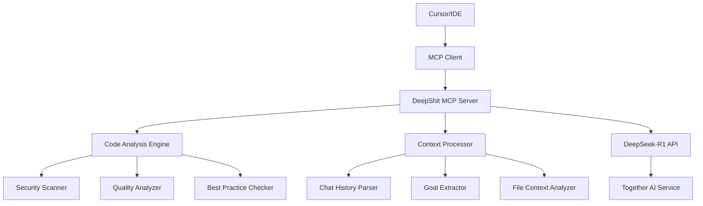

# DeepShit MCP Code Critic Server - Product Requirements Document

## 1. Product Overview

### Vision

Create an intelligent MCP server that provides contextual code criticism and improvement suggestions to AI agents during code generation, enhancing code quality and helping achieve user goals through iterative feedback loops.

### Mission

Bridge the gap between AI-generated code and production-ready code by providing intelligent, context-aware criticism that helps AI agents learn and improve their output quality.

### Product Name

**DeepShit MCP Code Critic** (leveraging DeepSeek-R1 for intelligent analysis)

## 2. Target Users

### Primary Users

- **AI Agents** (Claude, GPT-4, etc.) operating in IDEs like Cursor
- **Developers** using AI-assisted coding tools who want higher quality output

### User Personas

1. **AI Agent**: Needs structured feedback to improve code generation
2. **Developer**: Wants better AI-generated code that requires less manual review
3. **Development Teams**: Seeking consistent code quality standards

## 3. Problem Statement

### Current Pain Points

- AI-generated code often requires significant manual review and refactoring
- No systematic way for AI agents to learn from code quality feedback
- Lack of context-aware code criticism that understands user goals
- Generic linting tools don't provide intelligent alternatives
- No feedback loop between code generation and quality improvement

### Success Metrics

- **Code Quality Score**: Measurable improvement in generated code quality
- **Developer Satisfaction**: Reduced time spent on manual code review
- **Adoption Rate**: Number of active MCP server integrations
- **Revenue Growth**: Subscription and usage-based monetization

## 4. MVP Features

### Core Functionality

#### 4.1 Code Analysis Engine

- **Security Vulnerability Detection**

  - Common security anti-patterns (XSS, injection vulnerabilities)
  - Authentication/authorization issues
  - Data exposure risks
  - Dependency vulnerabilities

- **Code Quality Assessment**

  - Performance bottlenecks and optimizations
  - Maintainability issues (complexity, coupling)
  - Readability improvements (naming, structure)
  - Memory usage and resource management

- **Best Practices Enforcement**
  - TypeScript/JavaScript specific patterns
  - Framework-specific best practices (React, Node.js)
  - Modern ES6+ feature usage
  - Code organization and modularity

#### 4.2 MCP Tool Interface

```typescript
interface CodeCriticTool {
  name: "critique_code";
  description: "Analyze generated code for security, quality, and best practices";
  inputSchema: {
    code: string; // The generated code to analyze
    context: {
      userGoal: string; // User's stated objective
      relatedFiles: Array<{
        // Relevant existing files for context
        path: string;
        content: string;
        relevance: string;
      }>;
      language: "typescript" | "javascript";
      framework?: string; // React, Node.js, etc.
    };
    chatHistory: Array<{
      // Recent user messages for context
      message: string;
      timestamp: string;
    }>;
  };
}
```

#### 4.3 Structured Feedback Output

```typescript
interface CriticismResponse {
  overall_score: number; // 1-10 quality score
  critical_issues: Issue[]; // Must-fix problems
  suggestions: Suggestion[]; // Improvement recommendations
  alternatives: Alternative[]; // Better implementation options
  context_alignment: {
    // How well code matches user goals
    alignment_score: number;
    goal_analysis: string;
    recommendations: string[];
  };
}

interface Issue {
  type: "security" | "performance" | "maintainability" | "readability";
  severity: "critical" | "high" | "medium" | "low";
  line_range: [number, number];
  description: string;
  explanation: string;
  fix_suggestion: string;
}

interface Alternative {
  description: string;
  code_example: string;
  benefits: string[];
  trade_offs: string[];
}
```

## 5. Technical Architecture

### 5.1 System Components



### 5.2 Core Services

#### Analysis Service

- **Input Processing**: Parse code, context, and user goals
- **Multi-dimensional Analysis**: Security, quality, best practices
- **LLM Integration**: DeepSeek-R1 for intelligent criticism
- **Output Formatting**: Structured response for agent consumption

#### Context Service

- **Goal Understanding**: Extract user intentions from chat history
- **Code Relationship Analysis**: Understand how new code fits with existing files
- **Pattern Recognition**: Identify coding patterns and preferences

#### Integration Service

- **MCP Protocol**: Standard Model Context Protocol implementation
- **Tool Registration**: Register as available tool for AI agents
- **Error Handling**: Graceful degradation and error reporting

### 5.3 Technology Stack

- **Runtime**: Node.js/TypeScript
- **MCP Framework**: `@modelcontextprotocol/sdk-typescript`
- **LLM Integration**: Together AI SDK for DeepSeek-R1
- **Analysis Tools**:
  - ESLint for basic linting
  - TypeScript compiler API for type analysis
  - Custom security pattern detection
- **Code Parsing**: `@babel/parser` for AST analysis

## 6. User Experience Flow

### 6.1 Integration Flow

1. Developer installs DeepShit MCP server
2. Configures API keys and preferences
3. Server registers as available tool in IDE
4. AI agents can now call critique_code tool

### 6.2 Criticism Flow

1. **Code Generation**: AI agent generates code
2. **Tool Invocation**: Agent calls critique_code with generated code + context
3. **Analysis**: Server analyzes code using DeepSeek-R1 and built-in tools
4. **Feedback**: Returns structured criticism and alternatives
5. **Iteration**: Agent revises code based on feedback
6. **Validation**: Optional re-analysis for improvement verification

## 7. API Specification

### 7.1 MCP Tool Definition

```json
{
  "name": "critique_code",
  "description": "Analyze code for security vulnerabilities, quality issues, and best practice violations",
  "inputSchema": {
    "type": "object",
    "properties": {
      "code": {
        "type": "string",
        "description": "The code to analyze"
      },
      "context": {
        "type": "object",
        "properties": {
          "userGoal": { "type": "string" },
          "relatedFiles": { "type": "array" },
          "language": {
            "type": "string",
            "enum": ["typescript", "javascript"]
          },
          "framework": { "type": "string" }
        }
      },
      "chatHistory": { "type": "array" }
    },
    "required": ["code", "context"]
  }
}
```

### 7.2 Response Format

```json
{
  "overall_score": 7.5,
  "critical_issues": [
    {
      "type": "security",
      "severity": "high",
      "line_range": [15, 18],
      "description": "Potential XSS vulnerability in user input handling",
      "explanation": "Direct DOM manipulation without sanitization",
      "fix_suggestion": "Use textContent instead of innerHTML or sanitize input"
    }
  ],
  "suggestions": [
    {
      "type": "performance",
      "description": "Consider memoization for expensive calculations",
      "line_range": [25, 30],
      "impact": "Could improve render performance by 30%"
    }
  ],
  "alternatives": [
    {
      "description": "Use React.useMemo for expensive calculations",
      "code_example": "const result = useMemo(() => expensiveCalculation(data), [data]);",
      "benefits": ["Better performance", "Automatic dependency tracking"],
      "trade_offs": ["Slight memory overhead", "Added complexity"]
    }
  ],
  "context_alignment": {
    "alignment_score": 8.0,
    "goal_analysis": "Code achieves user's goal of creating a data visualization component",
    "recommendations": ["Consider accessibility features", "Add error handling"]
  }
}
```

## 8. Implementation Roadmap

### Phase 1: Core Infrastructure (Weeks 1-2)

- [ ] Set up MCP server skeleton
- [ ] Implement basic tool registration
- [ ] Create DeepSeek-R1 API integration
- [ ] Basic code parsing and analysis pipeline

### Phase 2: Analysis Engines (Weeks 3-4)

- [ ] Security vulnerability detection
- [ ] Code quality analysis (performance, maintainability)
- [ ] Best practices checker for TypeScript/JavaScript
- [ ] Context processing and goal extraction

### Phase 3: Integration & Testing (Weeks 5-6)

- [ ] MCP protocol compliance testing
- [ ] Cursor integration testing
- [ ] Response format optimization
- [ ] Performance optimization

### Phase 4: MVP Launch (Week 7)

- [ ] Documentation and setup guides
- [ ] Beta testing with early adopters
- [ ] Bug fixes and refinements
- [ ] Official release

## 9. Monetization Strategy

### 9.1 Revenue Models

#### Freemium Model

- **Free Tier**:
  - 100 code analyses per month
  - Basic security and quality checks
  - Standard best practices
- **Pro Tier** ($19/month):

  - Unlimited analyses
  - Advanced security scanning
  - Custom rule sets
  - Priority support

- **Enterprise Tier** ($99/month):
  - Team collaboration features
  - Custom integrations
  - Advanced analytics
  - SLA guarantees

#### Usage-Based Pricing

- **Pay-per-Analysis**: $0.02 per code analysis
- **Bulk Packages**: Discounted rates for high-volume users
- **API Access**: For companies building on top of the service

### 9.2 Value Proposition

- **Time Savings**: Reduced manual code review time
- **Quality Improvement**: Measurably better code output
- **Learning Acceleration**: Faster improvement of AI agent performance
- **Security Assurance**: Proactive vulnerability detection

## 10. Success Metrics & KPIs

### 10.1 Product Metrics

- **Monthly Active Users**: Target 1,000 MAU by month 6
- **Code Analyses**: Target 100,000 analyses per month
- **User Retention**: 70% monthly retention rate
- **Quality Score Improvement**: Average 15% improvement in code quality scores

### 10.2 Business Metrics

- **Revenue**: $10K MRR by month 6
- **Customer Acquisition Cost**: <$50 per customer
- **Customer Lifetime Value**: >$200
- **Conversion Rate**: 15% free-to-paid conversion

### 10.3 Technical Metrics

- **Response Time**: <2 seconds for code analysis
- **Accuracy**: 85% accuracy in vulnerability detection
- **Uptime**: 99.9% service availability
- **API Success Rate**: 99.5% successful API calls

## 11. Risk Assessment

### 11.1 Technical Risks

- **API Reliability**: Dependency on Together AI service
- **Performance**: Analysis speed at scale
- **Accuracy**: False positives in security detection

### 11.2 Business Risks

- **Competition**: Existing code analysis tools
- **Market Adoption**: Slow adoption of MCP protocol
- **Pricing**: Finding optimal pricing strategy

### 11.3 Mitigation Strategies

- **Fallback Systems**: Multiple LLM providers
- **Performance Optimization**: Caching and optimization
- **Gradual Rollout**: Beta testing and iteration

## 12. Next Steps

1. **Validate Technical Feasibility**: Test DeepSeek-R1 API for code analysis
2. **MVP Development**: Start with core infrastructure
3. **User Research**: Interview potential users for feedback
4. **Partnership Exploration**: Reach out to Cursor team for collaboration
5. **Funding Strategy**: Consider seed funding for accelerated development

---

_Document Version: 1.0_  
_Last Updated: [Current Date]_  
_Next Review: [Date + 2 weeks]_
